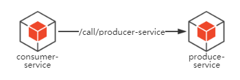
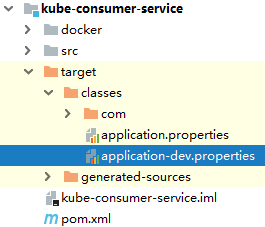
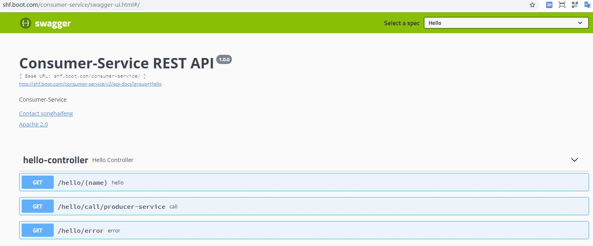

# Introduction
When we deploy services into k8s, they will call each other by serviceNames. 
But When we debug in our development tools(eg. IDEA), they call each other by endpoints.
So how can we reasonably accommodate both scenarios in a project? 

Here is a simple example showed how to achieve through `profileActive` which defines in pom.xml 
and `profile` which defines in springboot's application-{profile}.properties.

Defined two services:
 * consumer service
 * producer service

Consumer-service will call producer-service API, as follow




# How To Config 

## POM Configuration
- Defined `dev` as the default profile for debugging
```xml
    <profiles>
        <profile>
            <id>dev</id>
            <activation>
                <activeByDefault>true</activeByDefault>
            </activation>
            <properties>
                <profileActive>dev</profileActive>
            </properties>
        </profile>
    </profiles>
```

- Defined `k8s` profile for the install phase
```xml
    <profiles>
        <profile>
            <id>k8s</id>
            <properties>
                <profileActive>k8s</profileActive>
            </properties>
            <build>
                <plugins>
                    <plugin>
                        <groupId>com.spotify</groupId>
                        <artifactId>docker-maven-plugin</artifactId>
                        <version>1.0.0</version>
                        <executions>
                            <execution>
                                <phase>install</phase>
                                <goals>
                                    <goal>build</goal>
                                </goals>
                            </execution>
                        </executions>
                        <configuration>
                            <dockerDirectory>${project.basedir}/docker</dockerDirectory>
                            <pushImage>false</pushImage>
                            <imageName>
                                ${docker.image.prefix}/${project.artifactId}:${project.version}
                            </imageName>
                            <resources>
                                <resource>
                                    <targetPath>/</targetPath>
                                    <directory>${project.build.directory}</directory>
                                    <include>${project.build.finalName}.jar</include>
                                </resource>
                            </resources>
                        </configuration>
                    </plugin>
                </plugins>
            </build>
        </profile>
    </profiles>
```

- Filter resources by active profile
```xml
        <resources>
            <resource>
                <directory>src/main/resources</directory>
                <excludes>
                    <exclude>application*.properties</exclude>
                </excludes>
            </resource>
            <resource>
                <directory>src/main/resources</directory>
                <filtering>true</filtering>
                <includes>
                    <include>application.properties</include>
                    <include>application-${profileActive}.properties</include>
                </includes>
            </resource>
        </resources>
```

## Properties files
Here we need to create three properties files for different usages.
* `application.properties` for common configurations, will get `spring.profiles.active` value from the `pom.xml` above:
```text
spring.profiles.active=@profileActive@
```
* `application-dev.properties` for the development phase, config **endpoints** of external services:
```text
# producer service
external.services.producer-service.address=127.0.0.1:8080
``` 
* `application-k8s.properties` for the deployment phase(includes ci,qa,release,prod), config **serviceName** of external services: 
```text
# producer service
external.services.producer-service.address=producer-service-svc
```

# Debug IN IDEA
When we build this project by idea, we could found something interesting, as follow



Then we can run kube-consumer-service and kube-priducer-service by each respective startup classes.
## Test
* INPUT
```bash
curl localhost:8081/hello/call/producer-service
```
* OUTPUT
```text
Get response from producer-service : "hello consumer, I am songhaifeng(hostname)"
```

# Deploy In K8S
## Build images
Execute command  `mvn clean install -P k8s` to build docker images, then we will get images as follow:

-  consumer-service
```
local-dtr.com/kube-consumer-service:Develop
```

- producer-service
```
local-dtr.com/kube-producer-service:Develop
```

## Deploy into K8s
```bash
cd kubernetes & kubectl apply -f .
```

## Test
```bash
curl shf.boot.com/consumer-service/hello/call/producer-service

```
* OUTPUT
```text
Get response from producer-service : "hello consumer, I am producer-service-dm-ddbb6477d-j8rvn(hostname)"
```

# How to integrate swagger in k8s
## config
Add the base-url configuration for swagger's host in `application-k8s.properties`, like consumer-service as follow:
```text
# swagger configuration
springfox.documentation.swagger.v2.host=shf.boot.com/consumer-service
```
See more in `springfox.documentation.swagger2.web.Swagger2Controller`.

## test
Enter `http://shf.boot.com/consumer-service/swagger-ui.html` to require swagger-ui.html website of consumer-service:

